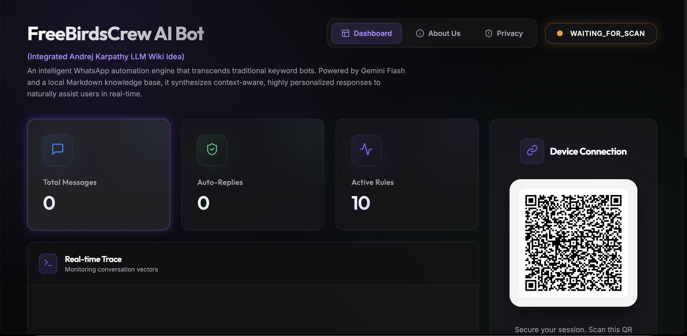

# WhatsApp AI Bot 🤖 (with LLM Wiki Brain)

A smart, AI-powered WhatsApp assistant built for **Simranjeet Singh** to automatically answer incoming messages using **Gemini 2.0 Flash**. 

Unlike standard bots that rely on fragile keyword-matching, or simple RAG setups that answer blindly from raw documents, this bot uses Karpathy's **[LLM Wiki Architecture](https://gist.github.com/karpathy/442a6bf555914893e9891c11519de94f)**. It reads from a curated, internal "knowledge wiki" to synthesize personalized, highly accurate responses with embedded direct links.



---

## 🚀 Features

- **LLM Wiki AI Engine:** The bot uses a combination of Intent Classification & Vectorless Retrieval to match user queries with structured knowledge stored in a central markdown wiki.
- **Smart Routing:** It automatically guides users to the right resources based on their questions:
  - Technical deep-dives (RAG, LLMs)? → Links to exact **YouTube playlists** and **GitHub repos**.
  - General chat/Networking? → Links to **Topmate Quick Connect**.
  - Mentorship requests? → Links to **Topmate 1:1 Guidance**.
- **Self-Documenting Log:** Every interaction is timestamped and recorded directly into the `log.md` page of the wiki for transparency.
- **Built-in Fallback:** If the Gemini API is down, rate-limited, or disabled, the bot seamlessly falls back to 10 solid keyword-matching rules so no message goes unanswered.
- **Admin Dashboard:** A beautiful web UI to monitor active rules, total messages processed, AI vs rule-based response ratio, and system logs.

---

## 🧠 The Wiki (Bot's Brain)

The bot's entire knowledge base lives locally inside `server/wiki/`. This means you can update the bot's knowledge simply by editing markdown files—no database or vector embeddings required!

| Markdown File | Purpose |
| ------------- | ------- |
| `about_simranjeet.md` | Background, expertise, social profile links. |
| `github_projects.md` | Over 10+ GitHub repos mapped to specific AI domains. |
| `youtube_content.md` | 8 dedicated Playlists to answer coding/tutorial questions. |
| `concepts_knowledge.md` | Explanations around RAG, LangChain, CrewAI, AutoGen, etc. |
| `topmate_booking.md` | Direct guidance on when to offer which Topmate session. |
| `medium_blogs.md` | List of publication topics written by Simranjeet. |
| `SCHEMA.md` | The strict system prompt holding tone guidelines and constraints. |

---

## 🛠️ Stack

*   **Backend:** Node.js, Express, `whatsapp-web.js`
*   **AI Engine:** `@google/generative-ai` (Gemini-2.0-Flash)
*   **Database:** SQLite (for chat logs and fallback rules)
*   **Frontend Dashboard:** React, Vite, Tailwind CSS (optional)

---

## 📦 Installation & Setup

### 1. Requirements
*   Node.js (v18+)
*   NPM / Yarn
*   A WhatsApp account (preferably a business / secondary number for the bot).
*   A **[Gemini API Key](https://aistudio.google.com/app/apikey)** (Free Tier works fine).

### 2. Getting Started
Clone the repository, then split into two terminals:

#### Terminal 1: Backend & Bot
```bash
cd server
npm install

# Setup your API key
cp .env.example .env
# Edit .env and paste your GEMINI_API_KEY inside!

npm run dev
```
Wait for the terminal to generate a **QR Code**. Scan it with your WhatsApp mobile app (Linked Devices) to authenticate the bot.

#### Terminal 2: Dashboard Frontend
```bash
cd frontend
npm install
npm run dev
```

Open `http://localhost:5173` in your browser to view the monitoring dashboard.

---

## 🔄 Interaction Examples

**User:** "I want to build an AI agent, do you have any code for that?"
**Bot (AI):** "🤖 Yes! I run an entire masterclass on Agentic AI. You can find all 15+ projects inside my [Awsome_AI_Agents repository (155⭐)](https://github.com/simranjeet97/Awsome_AI_Agents). If you prefer video, watch the entire playlist here: 📺 [Agentic AI 14 Projects](https://www.youtube.com/playlist?list=PLYIE4hvbWhsAkn8VzMWbMOxetpaGp-p4k). Let me know if you get stuck!"

**User:** "Can we jump on a call for career mentorship?"
**Bot (AI):** "🎯 I'd love to help out! For personalized 1:1 guidance on getting into AI/ML, please book a session with me here below:\n🚀 https://topmate.io/simranjeet97/145435"

---

## 🔧 Managing the Bot

**To update what the bot knows:**
Open any file in the `server/wiki/` directory and update the markdown. Changes will take effect immediately.

**To change the AI personality/rules:**
Edit `server/wiki/SCHEMA.md`.

**To view recent chats:**
Check the web dashboard or `server/wiki/log.md`.
